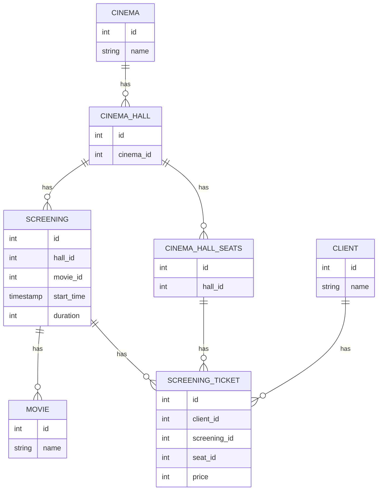

```mermaid
erDiagram
    CINEMA {
        int id
        string name
    }
    CINEMA ||--o{ CINEMA_HALL : has
    CINEMA_HALL {
        int id
        int cinema_id
    }
    CINEMA_HALL ||--o{ CINEMA_HALL_SEATS : has
    CINEMA_HALL_SEATS {
        int id
        int hall_id
    }
    CINEMA_HALL ||--o{ SCREENING : has
    SCREENING {
        int id
        int hall_id
        int movie_id
        timestamp start_time
        int duration
    }
    CLIENT {
        int id
        string name
    }
    CLIENT ||--o{ SCREENING_TICKET : has
    SCREENING_TICKET {
        int id
        int client_id
        int screening_id
        int seat_id
        int price
    }
    SCREENING ||--o{ SCREENING_TICKET : has
    CINEMA_HALL_SEATS ||--o{ SCREENING_TICKET : has
    SCREENING ||--o{ MOVIE : has
    MOVIE {
        int id
        string name
    }
```
