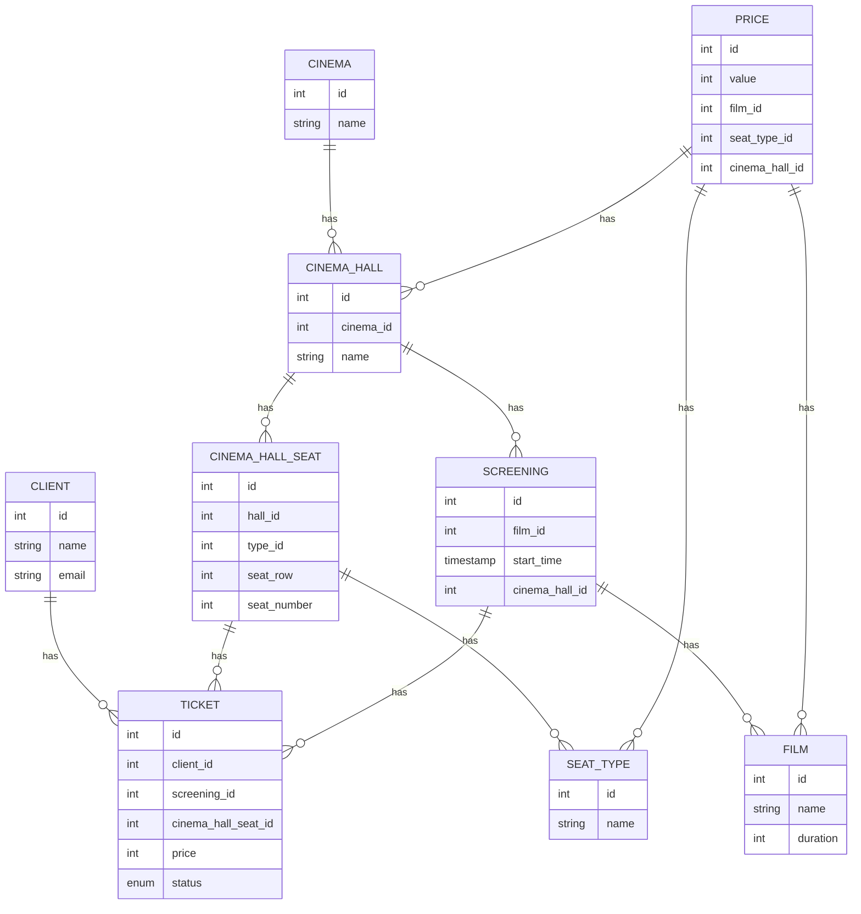

```mermaid
erDiagram
    CINEMA {
        int id
        string name
    }
    CINEMA_HALL {
        int id
        int cinema_id
        string name
    }
    SEAT_TYPE {
        int id
        string name
    }
    CINEMA_HALL_SEAT {
        int id
        int hall_id
        int type_id
        int seat_row
        int seat_number
    }
    FILM {
        int id
        string name
        int duration
    }
    SCREENING {
        int id
        int film_id
        timestamp start_time
        int cinema_hall_id
    }
    CLIENT {
        int id
        string name
        string email
    }
    TICKET {
        int id
        int client_id
        int screening_id
        int cinema_hall_seat_id
        int price
        enum status
    }
    PRICE {
        int id
        int value
        int film_id
        int seat_type_id
        int cinema_hall_id
    }

    CLIENT ||--o{ TICKET : has

    CINEMA ||--o{ CINEMA_HALL : has

    CINEMA_HALL ||--o{ CINEMA_HALL_SEAT : has
    CINEMA_HALL ||--o{ SCREENING : has

    CINEMA_HALL_SEAT ||--o{ TICKET : has
    CINEMA_HALL_SEAT ||--o{ SEAT_TYPE : has

    SCREENING ||--o{ TICKET : has
    SCREENING ||--o{ FILM : has

    PRICE ||--o{ FILM : has
    PRICE ||--o{ CINEMA_HALL : has
    PRICE ||--o{ SEAT_TYPE : has
```
