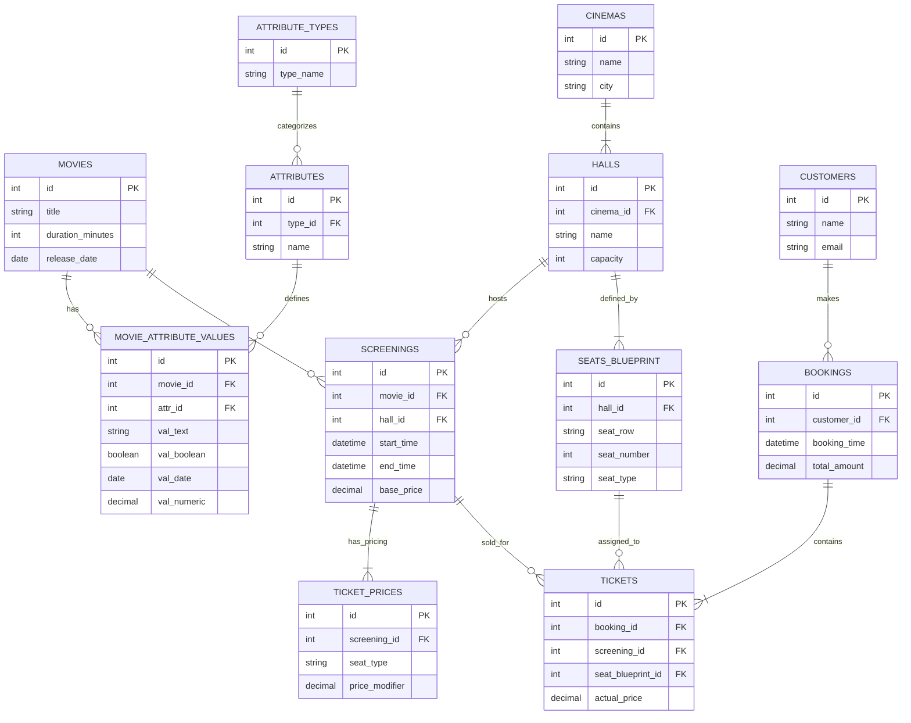

# Cinema Database Infrastructure

## 🛡 Security Policy
- **Network Isolation**: Секция `ports` запрещена. Доступ к БД осуществляется только через внутреннюю сеть Docker или SSH-туннель к Ubuntu VM (порт 5432).
- **Environment**: Любые пароли хранятся строго в `.env`.

## 📂 Project Structure

```text
cinema-db-project/
├── .env                       # Локальные секреты
├── .env.example               # Шаблон конфигурации
├── .gitignore                 # Защита от утечек
├── analytics.sql              # SQL-запрос для расчета прибыли
├── docker-compose.yml         # Контейнер PostgreSQL (No Ports)
├── init.sql                   # Схема БД (DDL) и тестовые данные
├── README.md                  # Технический паспорт
├── start.sh                   # Автоматизация деплоя
├── run_analytics.sh           # Запуск отчетов одной кнопкой
└── cleanup.sh                 # Полная очистка данных
```

## 🚀 Operations
Подготовка:
1. Создать локальный конфиг: cp .env.example .env
2. Выдать права скриптам: chmod +x *.sh

Запуск системы:
1. Deployment: ./start.sh
2. Analytics:  ./run_analytics.sh
3. Cleanup:    ./cleanup.sh

## 📊 Database Schema (ER Diagram)



## 📊 Database Management (Manual)
Если требуется выполнить скрипты вручную без использования bash-оберток:


# Запустить контейнер
```bash
docker compose up -d
```

# Импорт схемы
```bash
docker exec -i postgres_cinema psql -U ${DB_USER} -d ${DB_NAME} < init.sql
```

# Выполнение аналитического запроса
```bash
docker exec -i postgres_cinema psql -U ${DB_USER} -d ${DB_NAME} < analytics.sql
```

## 🛠 Проверка ДЗ №8 (EAV)
Реализация модели EAV (таблицы, данные и VIEW) интегрирована непосредственно в основной файл инициализации `init.sql`.

Для проверки гибкой схемы атрибутов и корректности сборки данных выполнить:
1. **Маркетинговые данные** (фильм, тип, атрибут, значение):
```bash
docker exec -it postgres_cinema psql -U evgeny87_user -d cinema_db -c "SELECT * FROM cinema.v_marketing_data;"
```
2. **Служебные задачи** (актуально сегодня и через 20 дней):
```bash
docker exec -it postgres_cinema psql -U evgeny87_user -d cinema_db -c "SELECT * FROM cinema.v_service_tasks;"
```
