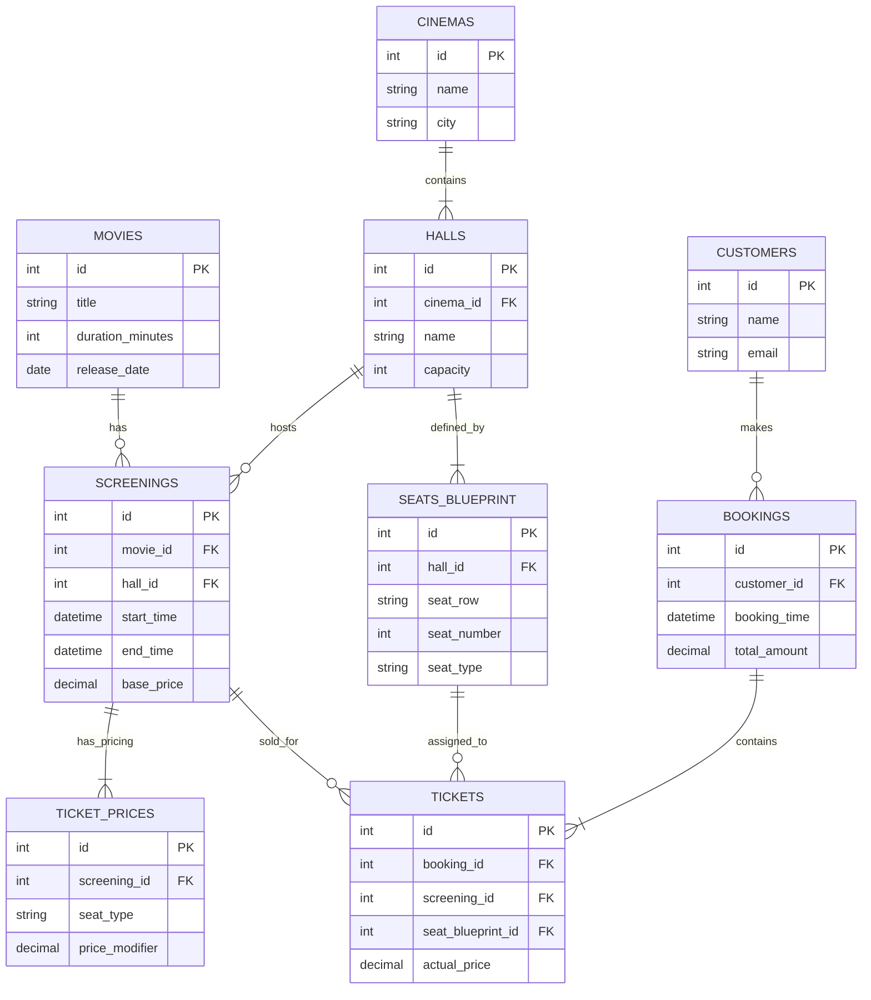

# Cinema Database Infrastructure

## 🛡 Security Policy
- **Network Isolation**: Секция `ports` запрещена. Доступ к БД осуществляется только через внутреннюю сеть Docker или SSH-туннель к Ubuntu VM (порт 5432).
- **Environment**: Любые пароли хранятся строго в `.env`.

## 📂 Project Structure
cinema-db-project/
├── .env                  # Локальные секреты
├── .env.example          # Шаблон конфигурации
├── .gitignore            # Защита от утечек
├── analytics.sql         # SQL-запрос для расчета прибыли
├── docker-compose.yml    # Контейнер PostgreSQL (No Ports)
├── init.sql              # Схема БД (DDL) и тестовые данные
├── README.md             # Технический паспорт
├── start.sh              # Автоматизация деплоя
├── run_analytics.sh      # Запуск отчетов одной кнопкой
└── cleanup.sh            # Полная очистка данных

## 🚀 Operations
Подготовка:
1. Создать локальный конфиг: cp .env.example .env
2. Выдать права скриптам: chmod +x *.sh

Запуск системы:
1. Deployment: ./start.sh
2. Analytics:  ./run_analytics.sh
3. Cleanup:    ./cleanup.sh

## 📊 Database Schema (ER Diagram)



## 📊 Database Management (Manual)
Если требуется выполнить скрипты вручную без использования bash-оберток:

```bash
# Запустить контейнер
docker compose up -d

# Импорт схемы
docker exec -i postgres_cinema psql -U ${DB_USER} -d ${DB_NAME} < init.sql

# Выполнение аналитического запроса
docker exec -i postgres_cinema psql -U ${DB_USER} -d ${DB_NAME} < analytics.sql
```