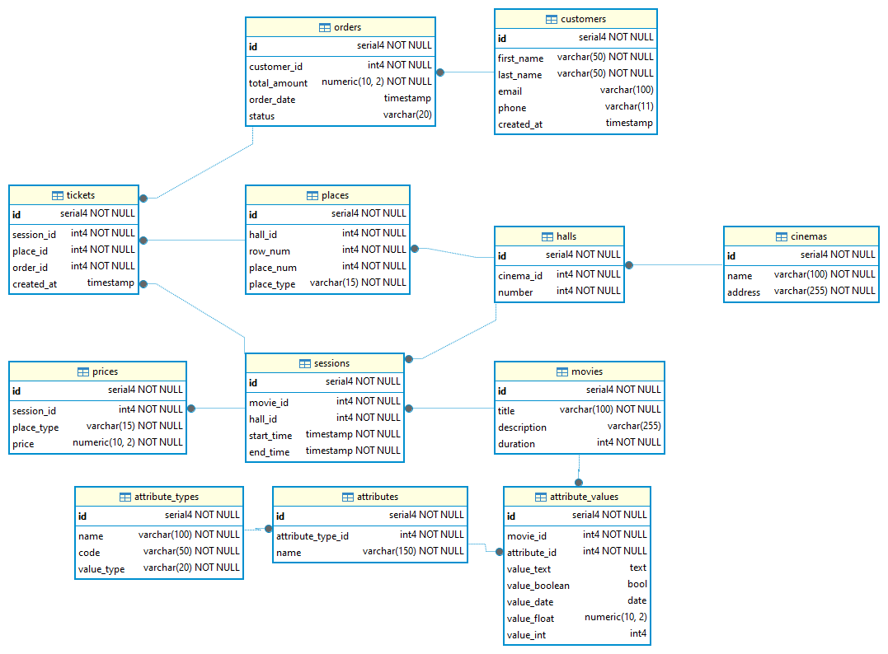

# Задание 8: IS/hw6

## Общее описание

```
Спроектировать EAV-хранение для базы данных кинотеатра
```

## Инфраструктура

### Схема развёртывания

Развёрнута следующая инфраструктура:

1. **Виртуальная машина**  
   - ОС: Ubuntu  
   - Среда: Oracle VirtualBox
   - Клиент для работы с БД: DBeaver

2. **Контейнер с `postgres:15`**  
   - Имеет открытый порт 5432 с проброской порта с локальной на гостевую машину.

## ER схема



## По ДЗ сделано:

### Таблица `attribute_types`

- id
- name
- code
- value_type

### Таблица `attributes`

- id
- attribute_type_id
- name

attribute_type_id и name уникальные.

idx_eav_attribute_type индекс на attribute_type_id для быстрого поиска.

### Таблица `attribute_values`

- id
- movie_id
- attribute_id
- value_text
- value_boolean
- value_date
- value_float
- value_int INTEGER,

movie_id и attribute_id уникальные.

idx_eav_movie индекс на movie_id для быстрого поиска.

idx_eav_attribute индекс на attribute_id для быстрого поиска.

## Views

### 04_view_movies_with_attributes

Вывод всех фильмов с атрибутами

### 05_view_premiere_2026

Премьеры 2026 года