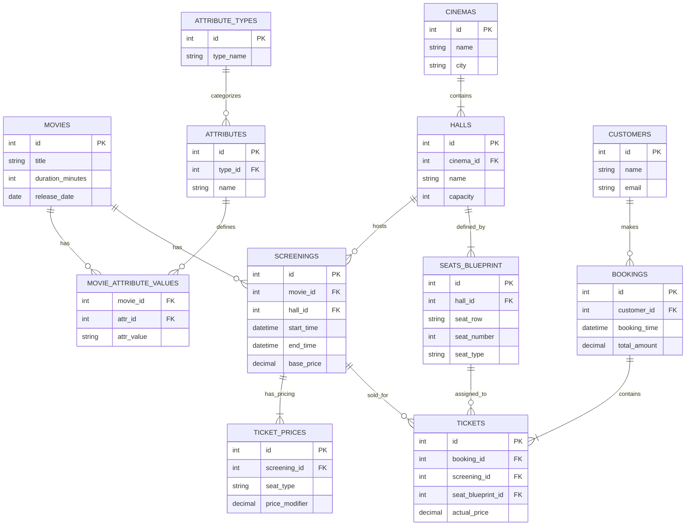

# Cinema Database Infrastructure

## 🛡 Security Policy
- **Network Isolation**: Секция `ports` запрещена. Доступ к БД осуществляется только через внутреннюю сеть Docker или SSH-туннель к Ubuntu VM (порт 5432).
- **Environment**: Любые пароли хранятся строго в `.env`.

## 📂 Project Structure
```text
cinema-db-project/
├── .env                       # Локальные секреты
├── .env.example               # Шаблон конфигурации
├── .gitignore                 # Защита от утечек
├── analytics.sql              # SQL-запрос для расчета прибыли
├── docker-compose.yml         # Контейнер PostgreSQL (No Ports)
├── init.sql                   # Схема БД (DDL) и тестовые данные
├── README.md                  # Технический паспорт
├── start.sh                   # Автоматизация деплоя
├── run_analytics.sh           # Запуск отчетов одной кнопкой
└── cleanup.sh                 # Полная очистка данных
```

## 🚀 Operations
Подготовка:
1. Создать локальный конфиг: cp .env.example .env
2. Выдать права скриптам: chmod +x *.sh

Запуск системы:
1. Deployment: ./start.sh
2. Analytics:  ./run_analytics.sh
3. Cleanup:    ./cleanup.sh

## 📊 Database Schema (ER Diagram)


## 📊 Database Management (Manual)
Если требуется выполнить скрипты вручную без использования bash-оберток:


# Запустить контейнер
```bash
docker compose up -d
```

# Импорт схемы
```bash
docker exec -i postgres_cinema psql -U ${DB_USER} -d ${DB_NAME} < init.sql
```

# Выполнение аналитического запроса
```bash
docker exec -i postgres_cinema psql -U ${DB_USER} -d ${DB_NAME} < analytics.sql
```

## 🛠 Проверка ДЗ №8 (EAV)
Реализация модели EAV (таблицы, данные и VIEW) интегрирована непосредственно в основной файл инициализации `init.sql`.

Для проверки гибкой схемы атрибутов и корректности сборки данных выполнить:
1. **Маркетинговые данные** (фильм, тип, атрибут, значение):
```bash
docker exec -it postgres_cinema psql -U evgeny87_user -d cinema_db -c "SELECT * FROM cinema.v_marketing_data;"
```
2. **Служебные задачи** (актуально сегодня и через 20 дней):
```bash
docker exec -it postgres_cinema psql -U evgeny87_user -d cinema_db -c "SELECT * FROM cinema.v_service_tasks;"
```

# ДЗ №9: Индексирование данных в БД Кинотеатра

## 1. Список запросов для анализа
В ходе работы проанализированы 6 ключевых запросов (3 простых и 3 сложных):
1. **Простой**: Выбор сеансов на конкретную дату.
2. **Простой**: Подсчёт проданных билетов за неделю.
3. **Сложный**: Формирование афиши (фильмы и время на сегодня).
4. **Сложный**: ТОП-3 самых прибыльных фильма за неделю.
5. **Сложный**: Проверка занятости мест на конкретный сеанс.
6. **Простой**: Диапазон цен (MIN/MAX) на билеты сеанса.

## 2. Сравнение производительности
| № запроса | База 10 000 строк | База 10 000 000 строк (Seq Scan) | 10 000 000 строк (Index Scan) |
| :--- | :--- | :--- | :--- |
| Q1 (Сеансы) | 16.1 ms | 460.5 ms | **122.1 ms** |
| Q2 (Билеты) | 1.6 ms | 87.3 ms | **32.4 ms** |
| Q3 (Афиша) | 11.5 ms | 90.0 ms | **0.9 ms** |
| Q4 (Прибыль) | 1.6 ms | 51.2 ms | **49.0 ms** |
| Q5 (Места) | 0.2 ms | 0.09 ms | **1.6 ms** |
| Q6 (Цены) | 0.03 ms | 0.04 ms | **0.04 ms** |

## 3. Оптимизации и индексы
Для ускорения работы на 10 млн строк были добавлены следующие индексы:
* `idx_screenings_start_time`: ускорил поиск по афише (Q3) в **90 раз**.
* `idx_bookings_time`: сократил время фильтрации по периодам продаж (Q2) в **3 раза**.
* `idx_tickets_screening_price`: покрывающий индекс для ускорения аналитических расчетов.

## 4. Статистика базы (Топ-5 объектов по размеру)
1. **tickets**: 1209 MB
2. **screenings**: 768 MB
3. **screenings_hall_id_excl**: 365 MB
4. **idx_tickets_screening_price**: 301 MB
5. **tickets_pkey**: 214 MB

## 5. Использование индексов
* **Самый частый**: `tickets_screening_id_seat_blueprint_id_key` (33 млн сканирований).
* **Неиспользуемые**: Индексы EAV-модели (`idx_eav_movie`), так как в данном сценарии не проводилась выборка по динамическим атрибутам.

## Дополнительная информация по реализации
* **Целостность данных**: При генерации 10 млн строк **не отключались** бизнес-ограничения (Constraints). Все билеты привязаны к реальным сеансам и местам.
* **Реализм**: Генерация данных имитирует работу мультиплекса из 15 залов в течение 11 лет (2015-2026) с реалистичными интервалами между сеансами.
* **Автоматизация**: Для повторения тестов подготовлены Bash-скрипты (`seed_load_test.sh`, `run_benchmarks.sh`).

## Как запустить тесты
1. `./start.sh` — поднять базу.
2. `./seed_load_test.sh` — заполнить 10 000 строк.
3. `./seed_10m.sh` — расширить до 10 000 000 строк.
4. `./run_benchmarks.sh` — получить планы выполнения.
