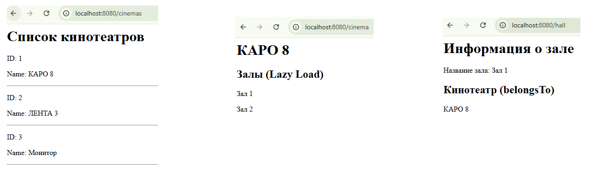

# Применение на практике востребованных паттернов работы с хранилищами

### Основная задача
1. Реализовать Active Record для произвольной таблицы
2. Критерии:
    - паттерн должен содержать метод массового получения информации из таблицы, результат которого возвращается в виде коллекции
    - использовать паттерн Identity Map для устранения дублирования объектов
    - Lazy Load для отложенной загрузки связанных записей в таблице или коллекции

------------

### Результат

------------

**Краткое описание проекта и его особенностей**

1. Стэк

    - php 8.3 
    - PDO
    - Composer
    - docker

2. Архитектурные решения

2.1. Паттерн Active Record реализован в абстрактном классе app/Infrastructure/Domain/Model.php

    - заполнение модели с учетом свойства fillable. Защита от массового заполнения. То есть перебираем массив $attributes, но решение о записи в $this->attr принимается на основании массива fillable 
    - с помощью статического свойства $table контролируем, что работаем с конкретной таблицей из базы данных. Одновременно проверяем наличие такого свойства через метод getTable
    - реализованы методы find (найти запись по id), all (выбрать все записи), where (извлечение данных по условию)

2.2. Паттерн Identity Map

    - реализован через статическое хранилище внутри базовой модели. При вызове find сначала проверяется наличие объекта в оперативной памяти. Это исключает лишние запросы к БД

2.3. Работа со связями и Lazy loading

    - Lazy loading реализована через метод __get(). Связанные данные (например, залы кинотеатра) не загружаются из БД пока не произойдет обращение к свойству $cinema->halls
    - загруженные связи сохраняются в массиве $relations. Это предотвращает повторные SQL-запросы при обращении к тому же свойству
    - методы связей: hasMany (поиск всех записей по внешнему ключу) и belongsTo (получение родительской записи, возвращается 1 объект)
    
3. Безопасность и надежность

    - защита от SQL инъекций - все запросы проходят через PDO::prepare(). Имена полей в методе where() фильтруются по fillable или регулярному выражению
    - синглтон DB - подключения к БД гарантирует одно активное соединение

#### Как запустить проект?

**Выполнить в терминале следующие команды (под ОС windows)**
 - клонировать проект из github репозитория и выполнить команду composer install
 - переименовать env файл: cp .env.example .env

**Запустить Docker, выполнив команду**

```
docker compose up --build -d
```

**Используйте встроенный сервер PHP**

```
php -S localhost:8000 -t public
```

**Наглядный пример**


