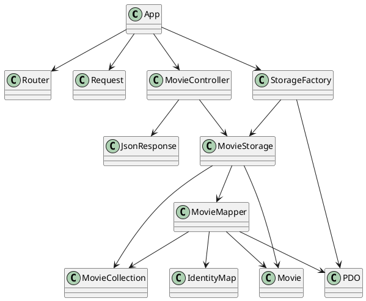
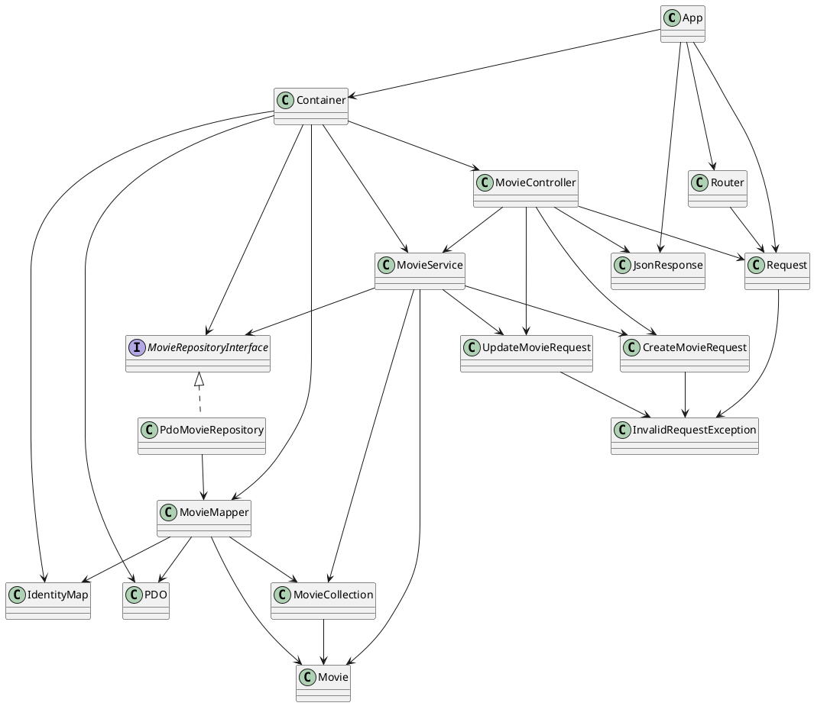

# Анализ кода проекта `otus/hw12-patterns-app`

## Что делает проект

Проект - небольшой REST API для фильмов:

- `GET /api/movies` - список фильмов;
- `GET /api/movies/{id}` - один фильм;
- `POST /api/movies` - создать фильм;
- `PUT /api/movies/{id}` - обновить фильм;
- `DELETE /api/movies/{id}` - удалить фильм.

В анализе рассмотрены простые проблемы архитектуры:

- контроллер зависел от конкретного класса хранения;
- контроллер делал слишком много работы;
- сущность `Movie` позволяла создать некорректный фильм;
- приложение было сложно расширять новым способом хранения.

## UML-схема до изменений



Главная проблема старой схемы: `MovieController` напрямую работал с `MovieStorage`, а `MovieStorage` сам создавал `MovieMapper`.

## 1. DIP: зависимость от конкретного хранилища

### Было

`MovieController` зависел от конкретного класса:

```php
public function __construct(
    private MovieStorage $storage,
) {
}
```

Из-за этого контроллер сложнее тестировать и сложнее заменить хранилище на другое.

### Стало

Добавлен интерфейс:

```php
interface MovieRepositoryInterface
{
    public function getAll(): MovieCollection;
    public function getById(int $id): ?Movie;
    public function save(Movie $movie): Movie;
    public function deleteById(int $id): bool;
}
```

Теперь контроллер зависит от интерфейса, а не от конкретной реализации:

```php
public function __construct(
    private MovieRepositoryInterface $movies,
) {
}
```

Результат: вместо PostgreSQL-репозитория можно подставить другую реализацию, например тестовую.

## 2. SRP: контроллер делал слишком много

### Было

Метод создания фильма в контроллере:

- читал тело запроса;
- парсил JSON;
- проверял обязательные поля;
- создавал фильм;
- формировал ответ.

То есть один метод отвечал сразу за несколько задач.

### Стало

Парсинг JSON перенесен в `Request`:

```php
$request->json();
```

Проверка входных данных перенесена в DTO:

```php
CreateMovieRequest::fromArray($request->json());
```

Бизнес-логика перенесена в `MovieService`.

Результат: контроллер стал проще. Он принимает HTTP-запрос, вызывает сервис и возвращает HTTP-ответ.

## 3. Инкапсуляция `Movie`

### Было

Фильм можно было создать в некорректном состоянии:

```php
$movie = new Movie('', -100, '', '');
```

Также можно было установить неверный год:

```php
$movie->setYear(99999);
```

### Стало

Создание и изменение фильма проходят через доменные методы:

```php
$movie = Movie::create('Interstellar', 2014, 'Sci-Fi', 'Christopher Nolan');
$movie->rename('New title');
$movie->changeYear(2015);
```

Внутри `Movie` добавлена проверка:

- название не должно быть пустым;
- год должен быть в допустимом диапазоне;
- идентификатор должен быть положительным.

Результат: сущность сама защищает свое состояние.

## 4. OCP: расширение способов хранения

### Было

`StorageFactory` жестко создавала PostgreSQL-хранилище:

```php
return new MovieStorage($pdo);
```

Если бы понадобилось другое хранилище, пришлось бы менять связанные классы.

### Стало

Сборка зависимостей перенесена в `Container`:

```php
public function movieRepository(): MovieRepositoryInterface
{
    return new PdoMovieRepository(
        new MovieMapper($this->pdo(), new IdentityMap()),
    );
}
```

Результат: можно добавить новую реализацию `MovieRepositoryInterface`, не меняя контроллер и сервис.

## UML-схема после изменений



## Итог

После изменений код стал проще разделен по ответственностям:

1. `MovieController` отвечает за HTTP.
2. `MovieService` отвечает за сценарии работы с фильмами.
3. `MovieRepositoryInterface` отделяет бизнес-логику от базы данных.
4. `PdoMovieRepository` отвечает за хранение через PostgreSQL.
5. `Movie` сама проверяет свое состояние.
6. `Container` собирает зависимости приложения.

Главный результат: код легче тестировать, проще читать и проще расширять.
