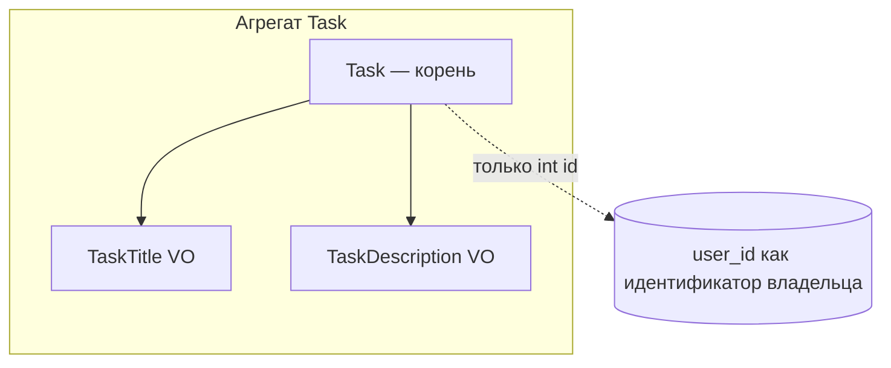
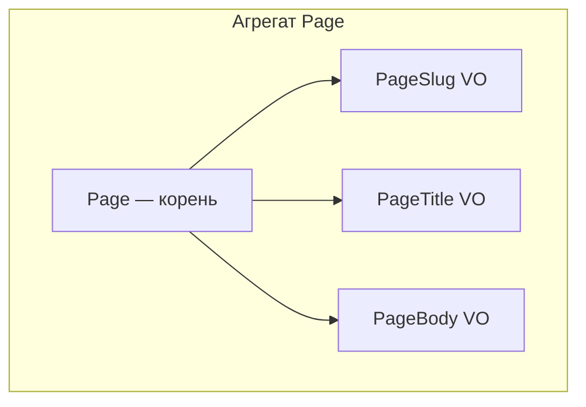

# Доменная модель (ДЗ 14)

## Поддомены

1. **Управление задачами пользователя** — персональные задачи: создание, выполнение, сроки. Граница: пользователь и его список задач, без связей с каталогом курсов.

2. **Контентные страницы (CMS)** — статические/динамические страницы сайта, публикация, slug для URL.

3. **Каталог обучения** — направления и курсы, заявки на курс; в этой работе в коде не переносится, остаётся отдельной зоной ответственности.

## Агрегаты и схемы

### Поддомен «Задачи»

### Поддомен «Страницы»

Корень агрегата **не** хранит ссылки на объекты других агрегатов (только значения и идентификаторы).

## Инфраструктура (Eloquent)

В `EloquentPageRepository::save()` используется `forceFill()` намеренно: репозиторий является инфраструктурным слоем для агрегата и сохраняет ровно ограниченный набор полей, определённых маппингом репозитория (а не пользовательским вводом). При изменении схемы таблицы новые колонки не попадут в запись автоматически, пока их явно не добавят в массив `forceFill()` в репозитории.
