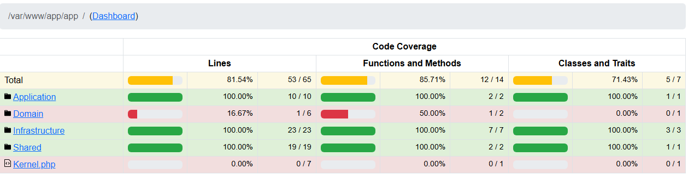
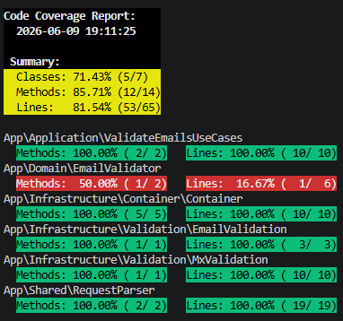

# Анализ кода

## 1. Основная задача
1.1. Покрыть юнит-тестами код приложения "Валидатор email"

1.2. Покрытие тестами должно иметь минимальный уровень в 65%

---

## 2. Результат

---

**Выполнить в терминале следующие команды (под ОС windows)**

 - composer install
 - cp .env.example .env

**Запустить Docker, выполнив команду**

- dev сборка

```
docker compose -f docker-compose.prod.yaml -f docker-compose.dev.yaml up --build -d
```

- prod сборка

```
docker compose -f docker-compose.prod.yaml up --build -d
```

**Запуск тестов**

```
 docker exec -it OtusDocker_php vendor/bin/phpunit
```

***Проверить покрытие***

```
 docker exec -it OtusDocker_php vendor/bin/phpunit --coverage-text 
```

### Покрытие тестами


    - 


    - 
