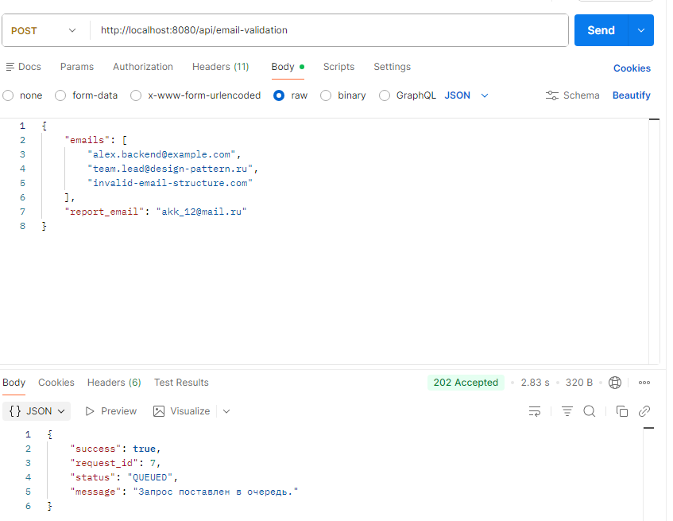
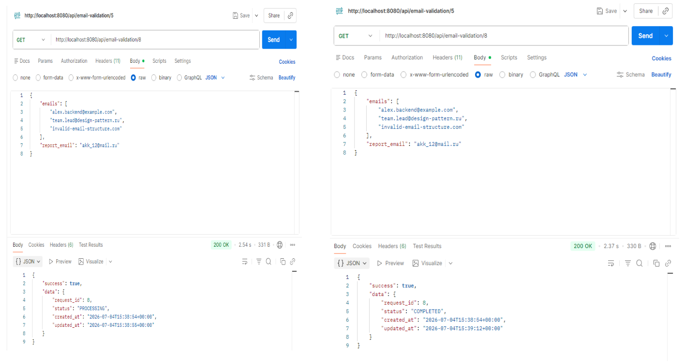
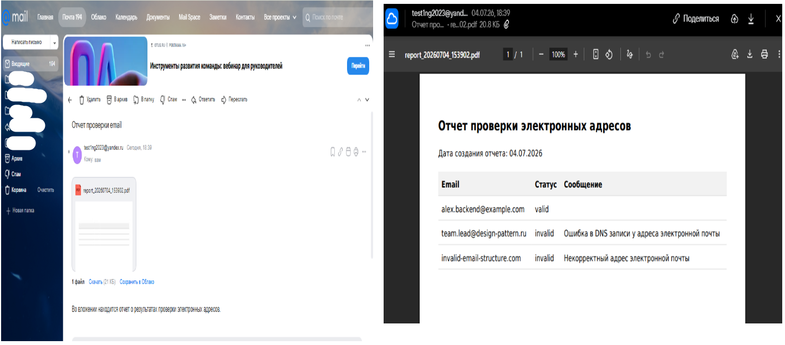

# Анализ кода

## 1. Основная задача

1.1. Модифицировать веб-приложение для работы в качестве REST API

1.2. Реализовать механизм приема HTTP-запросов, сохранения информации о задачах в базе данных PostgreSQL и предоставления клиенту возможности отслеживания статуса обработки по уникальному идентификатору запроса

---

## 2. Результат

---

### 2.1. Реализация REST API

Проект был переработан из приложения, ориентированного на работу через HTML-форму, в REST API.

Реализованы два конечных HTTP-метода:

- **POST /api/email-validation**

  Принимает JSON-запрос с перечнем электронных адресов и адресом электронной почты, на который необходимо отправить итоговый отчет.

  После успешной проверки входных данных:

  - создается запись о новой задаче в базе данных;
  - задача помещается в очередь RabbitMQ;
  - клиенту возвращается идентификатор созданной задачи и первоначальный статус обработки.

- **GET /api/email-validation/{request_id}**

  Выполняет поиск задачи по идентификатору и возвращает ее текущее состояние.

  Благодаря этому клиент может периодически опрашивать сервер, не удерживая открытое HTTP-соединение.

---

### 2.2. Реализация собственного механизма Routing

Для поддержки REST API реализован собственный механизм маршрутизации HTTP-запросов.

Созданы следующие компоненты:

- **Route**

  Отвечает за регистрацию маршрутов приложения.

  Поддерживает регистрацию:

  - GET-запросов;
  - POST-запросов.

- **RouteConfiguration**

  Хранит описание каждого маршрута:

  - URL;
  - контроллер;
  - действие контроллера.

- **RouteDispatcher**

  Выполняет:

  - сопоставление URI запроса с зарегистрированными маршрутами;
  - извлечение параметров маршрута;
  - создание экземпляра контроллера через DI-контейнер;
  - вызов необходимого метода контроллера.

В результате приложение не зависит от сторонних HTTP-фреймворков и полностью самостоятельно обрабатывает REST-запросы.

---

### 2.3. Интеграция PostgreSQL

Для хранения информации о запросах подключена база данных PostgreSQL.

Создан инфраструктурный слой Database, включающий:

- Connection

  Выполняет создание и повторное использование соединения PDO.

  Параметры подключения полностью вынесены в переменные окружения.

- Repository

  Реализует работу с таблицей хранения задач.

  Репозиторий отвечает исключительно за:

  - сохранение записи;
  - получение записи;
  - изменение статуса задачи.

Использование Repository позволило полностью отделить бизнес-логику приложения от SQL-запросов.

---

### 2.4. Хранение информации о задачах

Для отслеживания задачи создана отдельная таблица

```
email_validation_jobs
```

В таблице сохраняются:

- идентификатор задачи;
- текущий статус;
- список проверяемых адресов;
- адрес получателя отчета;
- дата создания;
- дата последнего изменения.

Каждый поступивший HTTP-запрос теперь фиксируется в базе данных еще до помещения сообщения в очередь.

---

### 2.5. Реализация Repository Pattern

Для работы с базой данных использован Repository Pattern.

Создан интерфейс

```
JobRepositoryInterface
```

который определяет контракт работы с задачами.

Реализована инфраструктурная реализация

```
PostgresJobRepository
```

с использованием PDO.

Репозиторий предоставляет методы:

- create()
- find()
- updateStatus()

Использование интерфейса позволило полностью скрыть детали работы с PostgreSQL от слоя Application.

---

### 2.6. Введение Domain Entity

Добавлена новая доменная сущность

```
EmailValidationJob
```

которая описывает бизнес-объект задачи проверки электронных адресов.

Entity содержит:

- идентификатор задачи;
- статус;
- список адресов;
- почту получателя;
- дату создания;
- дату изменения.

Изменение статуса производится через собственный метод объекта.

Благодаря этому бизнес-логика остается независимой от структуры базы данных.

---

### 2.7. Использование Enum

Для описания жизненного цикла задачи реализован Enum

```
JobStatus
```

состоящий из следующих статусов:

- QUEUED
- PROCESSING
- COMPLETED
- FAILED

---

### 2.8. Изменение сценария обработки запроса

Ранее приложение сразу публиковало сообщение в очередь RabbitMQ.

После доработки сценарий работы изменился.

Теперь последовательность обработки выглядит следующим образом:

1. Получение HTTP-запроса.

2. Проверка корректности входных данных.

3. Создание новой записи в PostgreSQL.

4. Получение автоматически сгенерированного идентификатора задачи.

5. Публикация сообщения в RabbitMQ вместе с идентификатором задачи.

6. Возврат клиенту идентификатора запроса.

Благодаря этому каждое сообщение в очереди имеет соответствующую запись в базе данных.

---

### 2.9. Реализация получения статуса задачи

Добавлен новый сценарий использования

```
GetEmailValidationStatusUseCase
```

который получает запись из базы данных по идентификатору задачи.

Контроллер формирует JSON-ответ с информацией о текущем состоянии обработки.

Пример ответа:

```json
{
    "request_id": 15,
    "status": "PROCESSING"
}
```

После завершения обработки клиент получает:

```json
{
    "request_id": 15,
    "status": "COMPLETED"
}
```

---

---

### 2.10. Использование Docker

В проект добавлены новые сервисы инфраструктуры.

- PostgreSQL

  Используется для хранения информации о задачах.

- pgAdmin

  Используется для просмотра содержимого базы данных.

При первом запуске контейнера автоматически создаются:

- схема базы данных;
- таблица хранения задач;
- необходимые расширения PostgreSQL.

---

### 2.11. Создана спецификация проекта

В проект добавлено описание API openapi.yaml файл 

---

## Результат работы приложения

### POST /api/email-validation

Запрос

```json
{
    "emails": [
        "test@gmail.com",
        "admin@test.ru"
    ],
    "report_email": "user@gmail.com"
}
```

Ответ

```json
{
    "success": true,
    "request_id": 1,
    "status": "QUEUED",
    "message": "Запрос поставлен в очередь."
}
```

---

### GET /api/email-validation/1

Во время обработки

```json
{
    "request_id": 1,
    "status": "PROCESSING"
}
```

После завершения

```json
{
    "request_id": 1,
    "status": "COMPLETED"
}
```

При возникновении ошибки

```json
{
    "request_id": 1,
    "status": "FAILED"
}
```

---

**Для запуска проекта необходимо вполнить в терминале следующие команды (под ОС windows)**

 - composer install
 - cp .env.example .env

**Запустить Docker, выполнив команду**

- dev сборка

```
docker compose -f docker-compose.prod.yaml -f docker-compose.dev.yaml up --build -d
```

- prod сборка

```
docker compose -f docker-compose.prod.yaml up --build -d
```

### Результат работы приложения

1. Запрос на POST /api/email-validation

    -  

2. Запрос на GET /api/email-validation/{request_id}

    -  

3. Скрин отчета с почты и pdf 

    -  


##ВНИМАНИЕ!!!

Если требуется отправка пиьма на почту, то необходимо в файле docker-compose.prod.yaml в образ queue_worker в раздел environment добавить:

MAIL_DRIVER: smtp;
SMTP_DSN: smtp://example@yandex.ru:<password>@smtp.yandex.com:587 (**Ваша запись для отправки письма с сервера и пароль**)
MAIL_FROM_ADDRESS: example@yandex.ru (**Электронный адрес, с которого будет отправляться почта**)

**В противном случае письма отправляться не будут**. 

Будет происходить вывод сообщения о результатах операции в консоль. 

Для проверки консоли, нужно зайти в контейнер очередей (образы должны быть созданы, контейнеры подняты)

```
docker logs <название вашего контейнера с очередью>_queue_worker-1 bash  
```