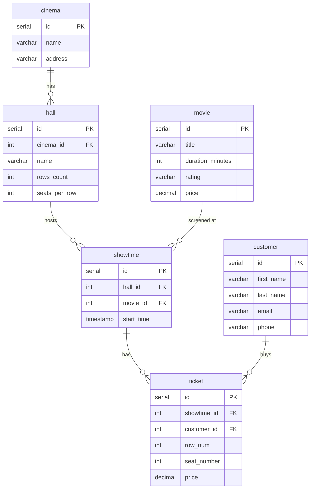

```mermaid
erDiagram
    cinema {
        serial id PK
        varchar name
        varchar address
    }

    hall {
        serial id PK
        int cinema_id FK
        varchar name
        int rows_count
        int seats_per_row
    }

    movie {
        serial id PK
        varchar title
        int duration_minutes
        varchar rating
        decimal price
    }

    showtime {
        serial id PK
        int hall_id FK
        int movie_id FK
        timestamp start_time
    }

    customer {
        serial id PK
        varchar first_name
        varchar last_name
        varchar email
        varchar phone
    }

    ticket {
        serial id PK
        int showtime_id FK
        int customer_id FK
        int row_num
        int seat_number
        decimal price
    }

    cinema ||--o{ hall : "has"
    hall ||--o{ showtime : "hosts"
    movie ||--o{ showtime : "screened at"
    showtime ||--o{ ticket : "has"
    customer ||--o{ ticket : "buys"
```