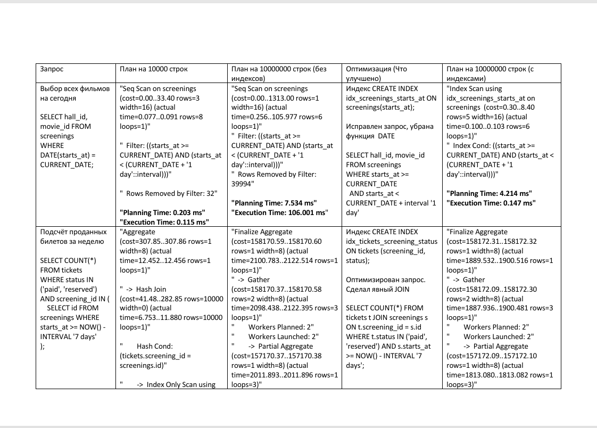

# Подготовить список из 6 основных запросов к БД

### Основная задача
  1. Выбор всех фильмов на сегодня
  2. Подсчёт проданных билетов за неделю
  3. Формирование афиши (фильмы, которые показывают сегодня)
  4. Поиск 3 самых прибыльных фильмов за неделю
  5. Сформировать схему зала и показать на ней свободные и занятые места на конкретный сеанс
  6. Вывести диапазон миниальной и максимальной цены за билет на конкретный сеанс

### Дополнительная задача
  1. Заполнить таблицы, увеличив общее количество строк текстовых данных до 10000. Провести анализ производительности запросов к БД, сохранить планы выполнения.
  2. Заполнить таблицы, увеличив общее количество строк текстовых данных до 10000000. Провести анализ производительности запросов к БД, сохранить планы выполнения.
  3. На основе анализа запросов и планов предложить оптимизации (индексы, структура, параметры и др.). Добавить индексы и сравните результат, приложив планы выполнения.

------------

### Результат

------------
1. Запросы на выборку данных

    - scripts/scripts.sql    

2. Таблица с результатами по каждому из 6 запросов:

[](assets/table.pdf)

[Открыть таблицу в формате PDF](assets/table.pdf)

4. Отсортированный список (15 значений) самых больших по размеру объектов БД:

[!Список самых больших значений](assets/2.png)]

6. отсортированные списки (по 5 значений) самых часто и редко используемых индексов: 

[!Список часто используемых индексов](assets/3.png)]

[!Список редко используемых индексов](assets/1.png)]

## Дополнительно. Можно посмотреть БД в pgAdmin

**Запустить Docker, выполнив команду** (не забыть переименовать env файл)

```
docker compose up --build -d
```

- сбросить volume

```
docker compose down -v
docker compose up -d
```

**Быстрая проверка**

```
docker exec -it postgres psql -U postgres -d cinema

SELECT * FROM cinema.movies;
```

**Подключение через pgAdmin**

http://localhost:5051

Логин: admin@mail.ru
Пароль: 112233

Приложение pgAdmin запускается с задержкой!!!

Выбрать в разделе "Быстрые ссылки" - Добавить новый сервер. Указываем любое имя/ Выбираем вкладку "Соединение"

- имя/адрес сервера: db
- порт: 5432
- служебная база данных: cinema
- Имя пользователя: cinema
- пароль: 112233
