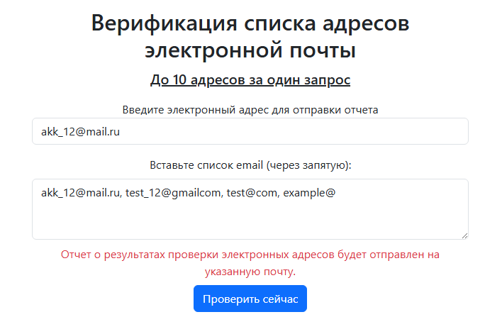
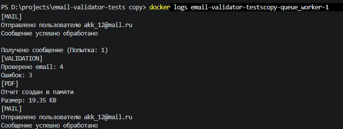
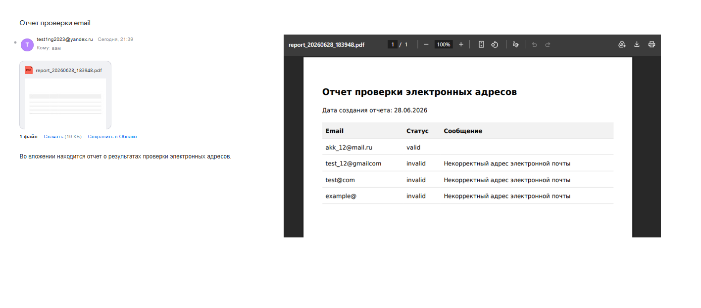

# Анализ кода

## 1. Основная задача

1.1. Создать веб-приложение для асинхронной обработки ресурсоемких отложенных запросов

1.2. Интегрировать брокер сообщений для надежной передачи задач от веб-сервера к фоновым обработчикам (воркерам) с последующим уведомлением пользователя

---

## 2. Результат

---

2.1. Рефакторинг архитектуры

    - произведен переход от синхронной обработки к асинхронной архитектуре, основанной на событиях и очередях

2.2. Разделение на слои и компоненты

    - проект расширен новыми инфраструктурными модулями, что позволило изолировать веб-сервер фоновых процессов

    - используемые слои и компоненты:
        - HTTP: содержит точку входа для пользователя, компоненты: форма приема POST-запросов и контроллер, отвечает за прием данных, оповещение пользователя

        - Infrastructure: содержит техническую реализацию обмена сообщениями, компоненты: RabbitMQ (контейнер rabbitmq:3.13-management-alpine). Слой содержит реализацию очередей (Queue), консольной команды (Console), pdf файлов (Pdf), сообений (Mail), проверки входных данных (Validation) и подключения HTML-шаблонов (Views). Rласс ConsumeQueueCommand - это консольная команда queue:consume (на базе Symfony\Component\Console\Command\Command).

        - Application: содержит сценарии обработки фоновых задач в директории UseCases. Класс ProcessValidationReportUseCase реализует логику валидация списка писем, создания pdf файла и отправки письма пользователю, т.е. оркеструет процесс. Класс EnqueueEmailValidationUseCase занимается постановкой задачи в очередь. 

        - Domain: содержит логику валидации электронных адресов, HTTP-запросов и подготовку ответов от приложения
        
2.3. Применение изученных принципов:   

    - Single Responsibility: обязанности строго разделены. Веб-контроллер занимается только приемом HTTP-запроса. Публикацией сообщения в очередь занимается слой Application. Воркер только слушает очередь. Сервис отправки уведомлений занимается исключительно почтой. Ни один класс не выполняет несколько не связанных задач одновременно
    
    - Open/Closed: система спроектирована с расчетом на добавление новых типов фоновых задач. Достаточно создать новый класс обработчика для нового типа сообщений, не меняя логику работы ядра самого воркера
    
    - Dependency Inversion:воркер и бизнес-логика не зависят от конкретных реализаций RabbitMQ или почтового сервера. Они зависят от абстракций (например, MailerInterface, Connection), которые внедряются в команду извне при ее запуске
        
    - DRY: настройки подключения к брокеру сообщений и почтовому серверу вынесены в переменные окружения (.env) и используются централизованно. Исключено дублирование конфигурационных параметров между веб-окружением и CLI-окружением
    
    - KISS: использование готового компонента Symfony Console для написания демона-воркера позволило избежать переусложненной ручной реализации парсинга аргументов командной строки и обработки системных сигналов завершения

        
2.4. Использование паттернов проектирования и инфраструктурных решений:

    - реализован паттерн асинхронного обмена сообщениями. Веб-приложение выступает в роли publisher, а фоновый скрипт — в роли сonsumer 
    
    - Command: запуск воркера инкапсулирован в паттерн Command. Это стандартизирует точку входа для CLI, упрощает запуск приложения из контейнера
    
    - DI: применен для автоматической сборки воркера. Контейнер config/container.php берет на себя ответственность за инстанцирование соединения с RabbitMQ, почтового клиента и логгера, передавая их в воркер до начала цикла прослушивания очереди
    
    - Worker Pattern: на уровне инфраструктуры Docker Compose выделен независимый контейнер queue_worker. Он запускается и работает изолированно от php-fpm веб-сервера
    

**Для запуска проекта необходимо вполнить в терминале следующие команды (под ОС windows)**

 - composer install
 - cp .env.example .env

**Запустить Docker, выполнив команду**

- dev сборка

```
docker compose -f docker-compose.prod.yaml -f docker-compose.dev.yaml up --build -d
```

- prod сборка

```
docker compose -f docker-compose.prod.yaml up --build -d
```

### Результат работы приложения

1. Форма ввода

    -  

2. Вывод данных в консоль

    -  

3. Скрин отчета с почты и pdf afqkf

    -  


## ВНИМАНИЕ!!!

Если требуется отправка пиcьма на почту, то необходимо в файле docker-compose.prod.yaml в образ queue_worker в раздел environment добавить:

```
MAIL_DRIVER: smtp;
SMTP_DSN: smtp://example@yandex.ru:<password>@smtp.yandex.com:587 (**Ваша запись для отправки письма с сервера и пароль**)
MAIL_FROM_ADDRESS: example@yandex.ru (**Электронный адрес, с которого будет отправляться почта**)
```

**В противном случае письма отправляться не будут**. 

Будет происходить вывод сообщения о результатах операции в консоль. 

Для проверки консоли, нужно зайти в контейнер очередей (образы должны быть созданы, контейнеры подняты)

```
docker logs <название вашего контейнера с очередью>_queue_worker-1 bash  
```

После необходимо отправить на сервер запрос с проверкой списка электронных адресов из формы. Форма доступна по адресу 

```
http://localhost:8080
```
