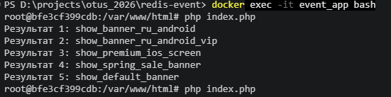

# Консольное приложение системы событий на Redis

### Основная задача
    1. Реализовать систему хранения и поиска событий на основе условий

    2. Каждое событие описывается:

        - priority — приоритет события (чем выше, тем важнее)
        - conditions — набор условий формата key=value
        - eventData — полезная нагрузка события (action / payload)

    3. Система должна:
        - хранить события в Redis
        - находить подходящее событие по входным параметрам
        - выбирать событие с максимальным priority
        - поддерживать быстрый поиск через индексы

------------

### Результат

------------

**Краткое описание проекта и его особенностей**

1. Стэк

    - PHP 8.3
    - Redis
    - Docker
    - CLI

2. Архитектурные решения. Проект разделен на 3 слоя
   
    2.1. Domain (бизнес-логика)
        - Основная доменная сущность - Event. Хранит события (id, priority, conditions, eventData). Проверяет на соответствие события входным данным. Серилизует данные для Redis

    2.2. Services (бизнес-логика поиска). 
        - Сервис поиска подходящего события - EventMatcherService. Получает список событий из хранилища. Фильтрует. Выбирает события с максимальным приоритетом. 

    2.3. Infrastructure (redis слой)
        - Реализация хранения событий в Redis - RedisEventService. Сохраняет события в Redis HASH. Индексирует по приоритету ZSET. Индексирование условий SET. Удаляет данные. Поиск по условию.

3. Redis структура данных

| Тип  | Ключ                      | Зачем                  |
| ---- | ------------------------- | ---------------------- |
| HASH | event:{id}                | хранение события       |
| ZSET | idx:priority              | сортировка по priority |
| SET  | condition:{key}:{value}   | индекс условий         |
| SET  | idx:empty_conditions      | события без условий    |

    - использовался подход в классе app/Infrastructure/BookSearch с multi_match и весовым коэффицентом, т.е. сопадение в заголовке книги (title^3) оценивается выше, чем в категории (category^1.5), что влияет на релевантность.
    - фильтры по цене и наличию книги в магазине работают в контексте фильтрации - для кэширования, ускоряя повторные запросы.
    - настроено автоматическое исправление опечаток ('fuzziness' => 'AUTO').

4. Логика поиска

    - Берутся события без условий
    - По каждому параметру формируются SET индексы
    - Выполняется объединение данных
    - Данные сортируются по priority
    - Выполняется проверка условий
    - Возвращается самое приоритетное событие

#### Как запустить проект?

**Выполнить в терминале следующие команды (под ОС windows)**
 - клонировать проект из github репозитория и выполнить команду composer install

**Запустить Docker, выполнив команду**

```
docker compose up --build -d
```

**Запуск контейнера**

```
docker exec -it event_app bash
```

**Запуск теста**

```
php index.php
```

**Консольный пример реализации поиска**


